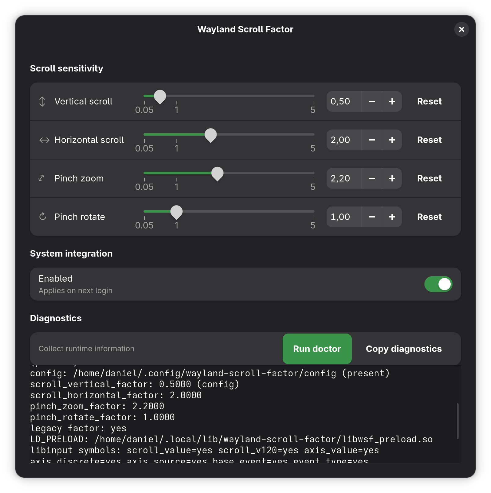

# Wayland Scroll Factor (WSF) — Niri Fork
[](LICENSE)

> **This is a fork of [daniel-g-carrasco/wayland-scroll-factor](https://github.com/daniel-g-carrasco/wayland-scroll-factor) adapted for the [niri](https://github.com/YaLTeR/niri) Wayland compositor.**

<p align="center">
  
</p>

<p align="center">
  <b>Tune touchpad gesture feel on Wayland</b><br>
  Predictable two‑finger scrolling (vertical + horizontal) and pinch zoom/rotate sensitivity for niri.<br>
  <i>Status: testing</i>
</p>

---

## What is WSF?

**WSF (Wayland Scroll Factor)** is a small utility that helps you adjust the *feel* of common touchpad gestures on Wayland:

- **Two‑finger scroll** (vertical and horizontal)
- **Pinch‑to‑zoom** sensitivity
- **Pinch rotate** sensitivity

WSF is intentionally narrow in scope and designed to be **safe, reversible, and practical** (tested on Arch + niri).

---

## Why does this exist?

On Wayland, touchpad gesture behavior is typically handled by the compositor. Many users run into one or more of these issues depending on hardware and distro defaults:

- Scroll feels **too fast/too slow** and there is **no simple system slider**.
- Horizontal scroll behavior is inconsistent across apps.
- Pinch‑to‑zoom in maps/photos can feel **hard to control**.
- Older hacks/workarounds can become **fragile** across compositor/libinput updates.

WSF exists to provide a **user‑level**, easy‑to‑roll‑back approach until upstream environments expose consistent, user‑facing controls.

---

## How it works (high level)

WSF ships two components:

1) **CLI (`wsf`)**  
   Reads/writes config and controls enable/disable and diagnostics.

2) **User‑level preload library (`libwsf_preload.so`)**  
   Interposes a small set of libinput functions used for scrolling and gestures and applies configurable scaling factors.

### Safety design choices

- **Per‑user only**: avoids `/etc/ld.so.preload`. Config is under `~/.config`.
- **Process guard rail**: the preload library is a no‑op unless the process is `niri` (so unrelated apps are not affected).
- **Touchpad‑only scroll scaling**: scroll scaling is applied only to finger/continuous sources, preserving mouse wheel behavior.
- **Narrow scope**: focuses on scroll + pinch sensitivity to reduce breakage across updates.
- **Diagnostics first**: `wsf doctor` reports symbol availability, active factors, and environment status.

> Enabling/disabling requires **logout/login** (or session restart) because environment changes must be picked up by niri.

---

## Quick start

Set a factor (example: slightly slower scroll):

```bash
wsf set 0.35
```

Enable for your session. Since niri runs as a systemd user service, create an override:

```bash
mkdir -p ~/.config/systemd/user/niri.service.d
cat > ~/.config/systemd/user/niri.service.d/wsf-preload.conf << 'EOF'
[Service]
Environment="LD_PRELOAD=$HOME/.local/lib/wayland-scroll-factor/libwsf_preload.so"
EOF
systemctl --user daemon-reload
```

Then **logout/login** for the changes to take effect.

Run diagnostics:

```bash
wsf doctor
```

Disable (rollback):

```bash
wsf disable
```

---

## CLI usage

### Build

```bash
meson setup build --prefix="$HOME/.local"
ninja -C build
```

### Install

```bash
meson install -C build
# or
./scripts/install.sh
```

### Common commands

- `wsf get` (or `wsf get --json`)
- `wsf set <factor>` (and/or per‑key factors if supported)
- `wsf enable` / `wsf disable` (**logout/login required**)
- `wsf status`
- `wsf doctor`

---

## GUI (GTK4 / libadwaita)

WSF includes a **GTK4/libadwaita** control app that uses the `wsf` CLI under the hood.

- Run: `wsf-gui`
- Reads values via `wsf get --json`
- Applies changes via `wsf set`

<p align="center">
  
</p>

---

## Configuration

WSF stores configuration under:

- `~/.config/wayland-scroll-factor/config`

Typical keys (depending on your version):

- `factor=...` (legacy / shared)
- `scroll_vertical_factor=...`
- `scroll_horizontal_factor=...`
- `pinch_zoom_factor=...`
- `pinch_rotate_factor=...`

You can also override values temporarily using environment variables (see `wsf --help` / docs).

---

## Uninstall / rollback

WSF is designed to be easy to remove.

Disable:

```bash
wsf disable
```

Remove config:

```bash
rm -rf ~/.config/wayland-scroll-factor
rm -f  ~/.config/environment.d/wayland-scroll-factor.conf
```

Remove installed files (user install):

```bash
rm -f  ~/.local/bin/wsf ~/.local/bin/wsf-gui
rm -rf ~/.local/lib/wayland-scroll-factor
```

After disabling/removal: **logout/login**.

---

## Packages

### Arch (AUR-style PKGBUILD)

```bash
cd packaging/aur
makepkg -si
```

This installs system‑wide under `/usr`. For custom library locations, set `WSF_LIB_PATH` before running `wsf enable`.

---

## Compatibility

- **Core (preload/CLI)** requires **libinput ≥ 1.19**
- **GUI** requires **libadwaita ≥ 1.4** (`Adw.ToolbarView` introduced in 1.4)

### Known working

- **Arch Linux (rolling)** + niri — primary test target

### CLI only (GUI too old)

- Ubuntu 22.04 LTS
- Debian 12

---

## Limitations

- Environment changes typically require **logout/login** to affect niri.
- WSF intentionally adjusts only a small subset of gesture feel controls.
- This fork targets niri only. For GNOME support, see the [upstream project](https://github.com/daniel-g-carrasco/wayland-scroll-factor).

---

## Contributing

Issues and PRs are welcome. When reporting a problem, please include:

- distro + niri version
- libinput version
- what you expected vs what happened
- output of `wsf doctor`

## Upstream

This fork tracks [daniel-g-carrasco/wayland-scroll-factor](https://github.com/daniel-g-carrasco/wayland-scroll-factor). To sync with upstream:

```bash
git fetch upstream
git merge upstream/main
```

---

## License

MIT License — see [`LICENSE`](LICENSE).

---

## Acknowledgements

WSF was inspired by the idea behind [`libinput-config`](https://github.com/lz42/libinput-config).
